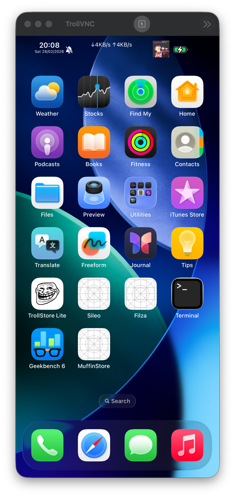

# vphone-aio

A script that runs **vPhone (iOS 26.1)**. The image is already **jailbroken with full bootstrap installed**.

---

## Setup Guide

Follow the steps below.

### 1. Install prerequisites

```bash
brew install git-lfs wget zstd libimobiledevice
````

---

### 2. Disable SIP and enable research guests

Boot into **Recovery Mode** (hold the power button → Options → Continue).

Open **Terminal** and run:

```bash
csrutil disable
csrutil allow-research-guests enable
```

Restart back into macOS.

---

### 3. Set boot arguments

After booting into macOS, run:

```bash
sudo nvram boot-args="amfi_get_out_of_my_way=1 -v"
```

---

### 4. Clone or download this repository

This repository is large (~12GB).
Download time may vary (for example, about 20 minutes on a fast connection).

```bash
git clone https://github.com/34306/vphone-aio.git
cd vphone-aio
```

---

### 5. Download missing split parts (optional)

If any parts are missing, the script will automatically download them.
You can also download them manually:

```bash
for p in aa ab ac ad ae af ag; do
  wget -O "vphone-cli.tar.zst.part_${p}" \
  "https://github.com/34306/vphone-aio/raw/refs/heads/main/vphone-cli.tar.zst.part_${p}?download="
done
```

---

### 6. Run the script

```bash
bash vphone-aio.sh
```

---

### 7. Storage requirement

Make sure your system has **at least 128GB of free disk space** (recommended).

---

### 8. Extraction process

The script will:

1. Merge the split archive files
2. Extract the full archive

Extraction takes approximately **15 minutes**.

---

### 9. Optional cleanup

After the merge and extraction are complete, you can remove unnecessary files:

```bash
rm -rf .git
rm vphone-cli.tar.zst.part_*
```

---

### 10. Connect via VNC

Use **RealVNC** or **macOS Screen Sharing** and connect to:

```
vnc://127.0.0.1:5901
```

---

### 11. Enjoy 🎉

vPhone should now be running.

---

# SHA-256 Checksums

Use the following checksums to verify the downloaded files are not corrupted.

```
3c966247deae3fff51a640f6204e0fafc14fd5c76353ba8f28f20f7d1d29e693  vphone-cli.tar.zst.part_aa
c7d11bbbe32dda2b337933c736171cc94faab2c7465e75391fa49029f3b6f1b1  vphone-cli.tar.zst.part_ab
f422949080e7f141f32f35f8ea20c1fedffc2b97eadf0390645114feef6bb1aa  vphone-cli.tar.zst.part_ac
f3acfa47145207b8962ba4d20fb83eb4646934cca768906e65609d7fdde564e7  vphone-cli.tar.zst.part_ad
efdca69df80386b0aa7af8ac260d9ac576ed1f258429fd4ac21b5bbb87cd78fe  vphone-cli.tar.zst.part_ae
4628852da12949361d3ea6efcf8af1532eb52194cc43a4ab4993024267947587  vphone-cli.tar.zst.part_af
8bd1551511eb016325918c2d93519829be04feb54727612e74c32e4299670a88  vphone-cli.tar.zst.part_ag
```

Verify using:

```bash
shasum -a 256 vphone-cli.tar.zst.part_a*
```

---

# Preview



---

# Credits

* **wh1te4ever (Hyungyu Seo)**
  [https://github.com/wh1te4ever](https://github.com/wh1te4ever)
  Super detailed write-up:
  [https://github.com/wh1te4ever/super-tart-vphone-writeup](https://github.com/wh1te4ever/super-tart-vphone-writeup)

* **Lakr233**
  [https://github.com/Lakr233](https://github.com/Lakr233)
  Non-Tart vPhone repository:
  [https://github.com/Lakr233/vphone-cli](https://github.com/Lakr233/vphone-cli)
